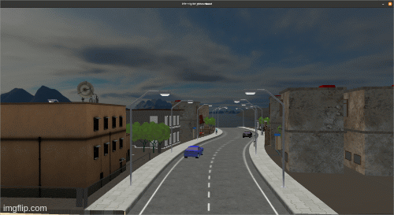

# Friendly-Neighbourhood

## Abstract 

The Friendly Neighbourhood , a project on Computer Graphics (EX603) for III/I  developed on OpenGL programming interface, is a hospitable environment that includes different types of buildings, roads, trees and people living there. It attempts to model a part of the modern habitat of human beings. Lighting from sun and street bulbs provide realistic view of the ecosystem. Keyboard and mouse inputs change the camera perspective and give smooth viewing experience. Some houses provide a way to their inner decoration that includes tables, stairs and other interior items. The project meets the objective to implement graphics pipe lining into the OpenGL API. 

### Built With 

The project is implemented in C++ 

#### Dependencies 

* GLFW 

* Glad 

* Assimp

* 8 GB RAM suggested for better operation * 

***[Find blender files here] (https://mega.nz/folder/wnAgXZTZ#EMtPdJk7oTwM6HBe13-2XA)*** 

